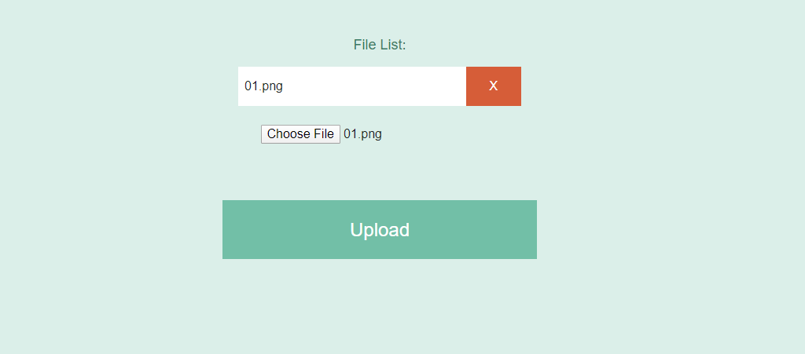
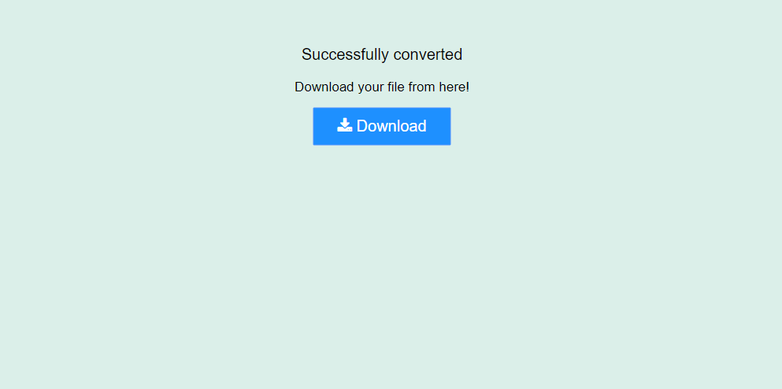

## ImageToPDF Website💻 using Python Framework FLask
This webapp created using python framework Flask which can convert chosen image into PDF

## Installment Requirements
- `pip install flask`
- `pip install img2pdf`

## Run the below command

- `python App.py`

## Screenshots

## Just follow☝️ me and Star⭐ my repository 
